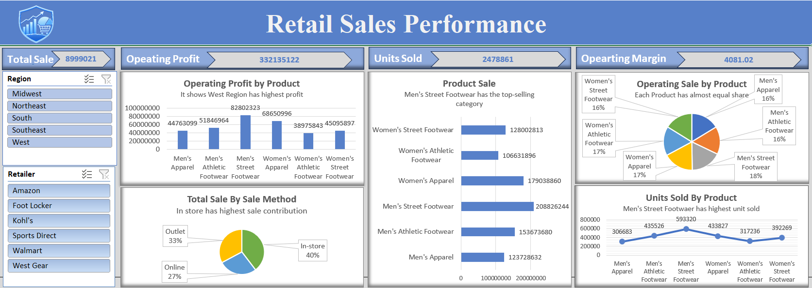

# 🛍️ Retail Sales Performance Dashboard

## 📖 Project Overview

The **Retail Sales Performance Dashboard** is an interactive **Power BI** dashboard designed to analyze retail business performance across various regions, retailers, products, and sales methods. It helps stakeholders monitor key performance indicators (KPIs), identify sales trends, evaluate profitability, and make data-driven business decisions.

---

## 📊 Key Performance Indicators (KPIs)

| 📈 KPI | 📊 Value |
|--------|----------|
| 💰 Total Sales | **8,999,021** |
| 💵 Operating Profit | **332,135,122** |
| 📦 Units Sold | **2,478,861** |
| 📉 Operating Margin | **4,081.02** |

---

# 🖼️ Dashboard Preview

---

# 🎛️ Dashboard Filters

### 🌍 Region
- 🟦 Midwest
- 🟦 Northeast
- 🟦 South
- 🟦 Southeast
- 🟦 West

### 🏪 Retailer
- 🛒 Amazon
- 👟 Foot Locker
- 🏬 Kohl's
- ⚽ Sports Direct
- 🛍️ Walmart
- 🎒 West Gear

---

# 📈 Dashboard Visualizations

## 💰 Operating Profit by Product

### 📌 Insights
- 🏆 Men's Street Footwear generated the highest operating profit.
- 📈 Women's Apparel contributed significantly to overall profit.
- 👕 Men's Apparel generated comparatively lower profit.

---

## 📦 Product Sales Analysis

### 📌 Insights
- 🥇 Men's Street Footwear is the highest-selling product category.
- 👚 Women's Apparel ranks second in total sales.
- 👕 Men's Apparel has the lowest sales among the categories.

---

## 🥧 Operating Sales Share by Product

### 📌 Insights
- ⚖️ Sales contribution is evenly distributed across products.
- 📊 Each category contributes approximately **16–18%** of total operating sales.

---

## 🛒 Total Sales by Sales Method

### 📌 Insights
- 🏬 In-store Sales: **40%**
- 🏪 Outlet Sales: **33%**
- 🌐 Online Sales: **27%**

---

## 📦 Units Sold by Product

### 📌 Insights
- 🏆 Men's Street Footwear recorded the highest number of units sold.
- 📈 Women's Street Footwear ranked second.
- 👕 Men's Apparel recorded the fewest units sold.

---

# ✨ Dashboard Features

- 📊 Interactive KPI Cards
- 🌍 Region-wise Filtering
- 🏪 Retailer-wise Analysis
- 💰 Operating Profit Analysis
- 📦 Product-wise Sales Comparison
- 🥧 Product Contribution Analysis
- 📈 Units Sold Trend Analysis
- 🎯 Interactive Slicers

---

# 🛠️ Tools & Technologies

- 📊 Power BI
- 📑 Microsoft Excel
- 🧹 Power Query
- 🧮 DAX (Data Analysis Expressions)
- 📈 Data Visualization

---

# 📌 Business Insights

- 💰 Men's Street Footwear is the top-performing product category.
- 🏬 In-store purchases contribute the largest share of total sales.
- 🌍 Regional filtering enables location-wise business analysis.
- 📊 Product sales are fairly balanced across categories.
- 📦 Higher units sold are strongly associated with increased operating profit.

# 👨‍💻 Author

### **Prachi Sharma**

📧 Email: prachi2sharma000@egmail.com

🐙 GitHub: https://github.com/Prachisharma1

💼 LinkedIn: www.linkedin.com/in/prachi-sharma-11831330b
